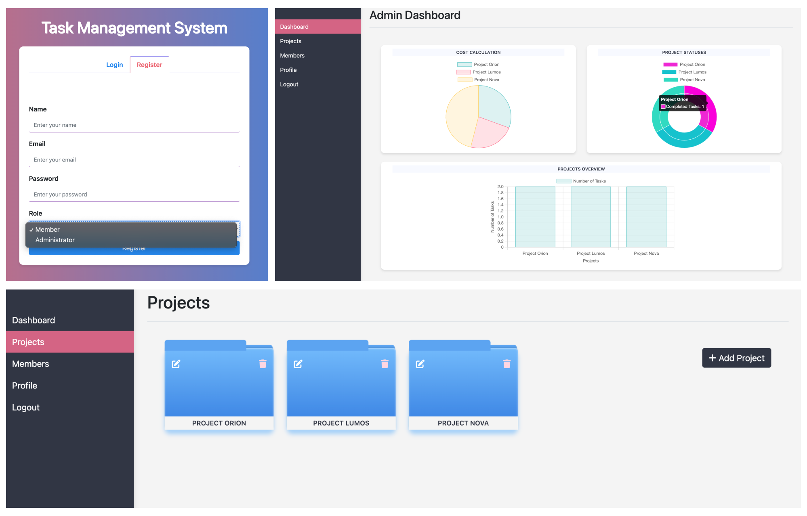

# Task Management System


## Overview
The Task Management System is a web-based application designed to help administrators manage projects and tasks efficiently. It allows administrators to add projects, assign tasks to members, and track the progress and completion of tasks. Members can mark their tasks as in-progress or completed and log the hours taken to complete each task. The system provides dashboards for both administrators and members to view their respective activities and progress.

## Screenshots


## Live Demo
View the live system [here](https://yourdomain.com/task-management-system).

## Features
- **Admin Panel**:
  - Add and manage projects.
  - Assign tasks to registered members.
  - View dashboard for a quick glance at projects, task statuses, and revenue generated.

- **Member Panel**:
  - View assigned tasks.
  - Mark tasks as in-progress or completed.
  - Log hours taken to complete tasks.
  - View personal dashboard for task status.

## Technologies Used
- **Frontend**:
  - HTML
  - CSS
  - JavaScript

- **Storage**:
  - Session Storage

## Getting Started
### Prerequisites
To run the Task Management System, you need a modern web browser with JavaScript enabled.

### Installation
1. Clone the repository:
   ```bash
   git clone https://github.com/yourusername/task-management-system.git

2. Navigate to the project directory:
   ```bash
   cd task-management-system
3. Open index.html in your web browser to start the application.

### Usage
#### Admin:
- Add new members and administrators.
- Create new projects and tasks.
- Assign tasks to registered members.
- View the admin dashboard for an overview of project progress and revenue.

#### Members:
- Log in to view assigned tasks.
- Mark tasks as in-progress or completed.
- Enter hours taken to complete tasks.
- View personal dashboard for task status updates.

## Contact
For any inquiries or feedback, please contact at [nainsonia92@gmail.com](mailto:nainsonia92@gmail.com).
